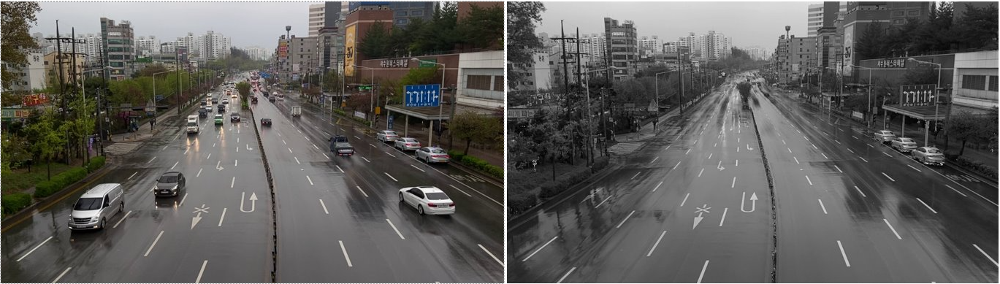
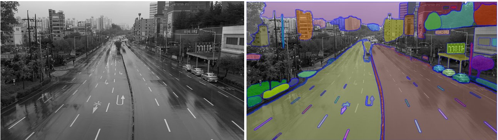
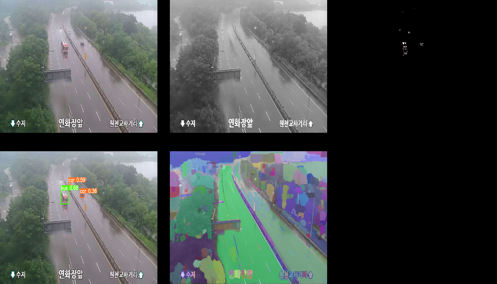

<div align="center">

### Automation Lab, Sungkyunkwan University
  
# Lane Detection for CCTV-cameras using SAM and Adaptive Hough Transform

Prepare for an updated version, include:

- Background subtraction module

- Segment Anything module -> Generate Lane segments

- Yolov8 model -> detect vehicles
- Overall Process
  

</div>


## Introduction

~~- Lane Detection method for CCTV-cameras using Yolov8 + SegmentAnything + ByteTrack~~
- Lane Detection method for CCTV-cameras using RTM + Norfair + SegmentAnything + Adaptive HoughR

## Installation

# Create conda env

# Activate env

# Install pytorch

```Shell
conda install pytorch torchvision torchaudio pytorch-cuda=11.8 -c pytorch -c nvidia
```

# Install mmdetection
```Shell
pip install -U openmim
mim install mmengine
mim install "mmcv>=2.0.0"


git clone https://github.com/open-mmlab/mmdetection.git
cd mmdetection
pip install -v -e .
```

# Install Norfair
```Shell
pip install norfair[metrics,video]
```

#Install SegmentAnything
```Shell
pip install git+https://github.com/facebookresearch/segment-anything.git
```

# Create folder as the following structure

## Getting Started

<!---
### Training and Evaluate CLRNet using Tusimple and CULane

```Shell
python main.py [configs/path_to_your_config] --gpus [gpu_num]
```
For example, run
```Shell
python main.py configs/clrnet/clr_resnet18_culane.py --gpus 0
```

For testing, run
```Shell
python main.py [configs/path_to_your_config] --[test|validate] --load_from [path_to_your_model] --gpus [gpu_num]
```

For example, run
```Shell
python main.py configs/clrnet/clr_dla34_culane.py --validate --load_from culane_dla34.pth --gpus 0
```


### Prepare CCTV-Camera Dataset

Contact administrator for dataset.

For CCTV-Camera, the folder structure is like this:

```
$CCTV-CameraROOT/Suwon_Initial      # data folders
$CCTV-CameraROOT/Suwon              # data folders
$CCTV-CameraROOT/list               # data lists
```

### Run inference for CCTV-Camera Dataset

Download the "r101_tusimple_ckpt69.pth" weight from [trained-weights]

Then run: 
```Shell
python cctv_infer.py configs/clrnet/clr_resnet101_tusimple_cctv.py --test --load_from r101_tusimple_ckpt69.pth --gpus 0 --view
```
--->

## Results

[trained-weights]: https://drive.google.com/drive/folders/1N3EUMyaFJnCrAWhJkmEpeWx39gCa3Mo_?usp=share_link


### Reproduce results using F1 score metric. 

| Backbone                                                |    CULane     |   Tusimple    |
|:--------------------------------------------------------|:-------------:|:-------------:|
| CLRNet-Resnet18  / [CLRNet-Resnet18*][trained-weights]  | 79.58 / 79.49 | 97.89 / 97.82 |
| CLRNet-Resnet34  / [CLRNet-Resnet34*][trained-weights]  | 79.73 / 79.44 | 97.82 / 97.97 |
| CLRNet-Resnet101 / [CLRNet-Resnet101*][trained-weights] | 80.13 / 79.92 | 97.62 / 97.71 |
'*' method is the reproduced results.

'F1@50' refers to the official metric,
i.e., F1 score when IoU threshold is 0.5 between the gt and prediction. 'F1@75' is the F1 score when IoU threshold is 0.75.

### CCTV-Camera Visualization 


##  Acknowledgement
<!--ts-->
* [open-mmlab/mmdetection](https://github.com/open-mmlab/mmdetection)
* [pytorch/vision](https://github.com/pytorch/vision)
* [Turoad/lanedet](https://github.com/Turoad/lanedet)
* [ZJULearning/resa](https://github.com/ZJULearning/resa)
* [cfzd/Ultra-Fast-Lane-Detection](https://github.com/cfzd/Ultra-Fast-Lane-Detection)
* [lucastabelini/LaneATT](https://github.com/lucastabelini/LaneATT)
* [aliyun/conditional-lane-detection](https://github.com/aliyun/conditional-lane-detection)
<!--te-->

