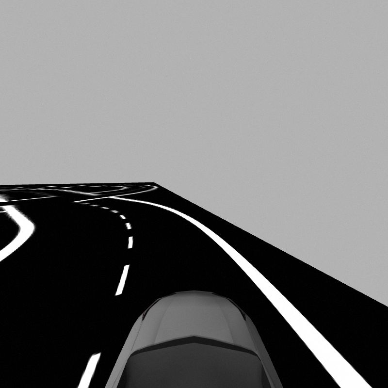
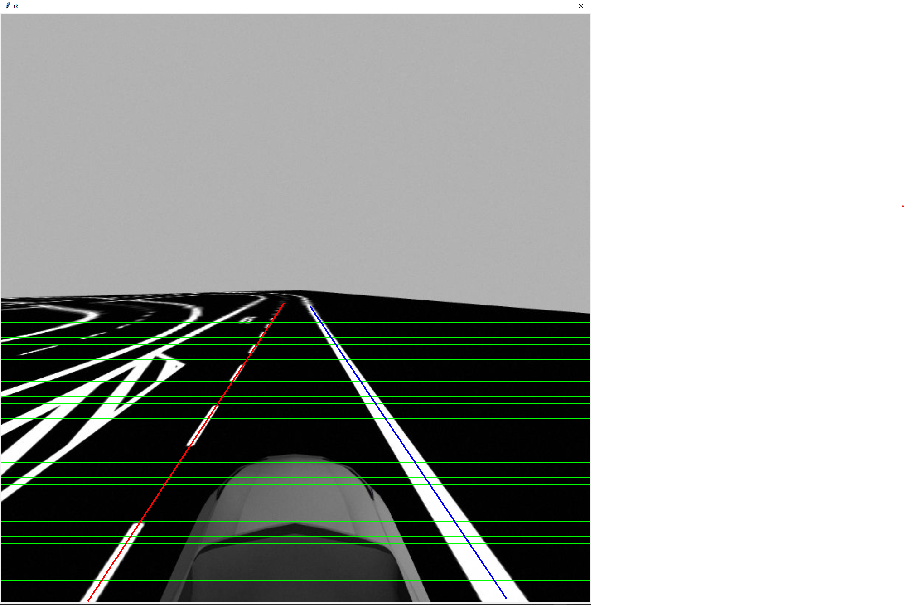
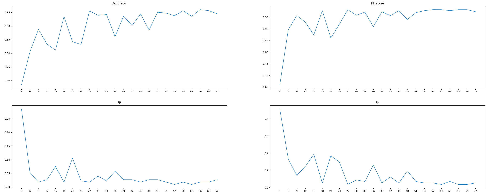
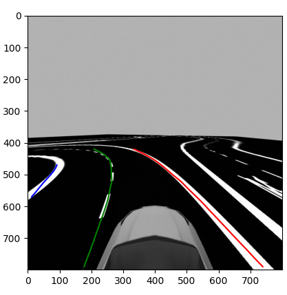
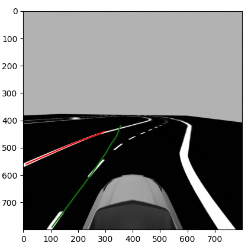
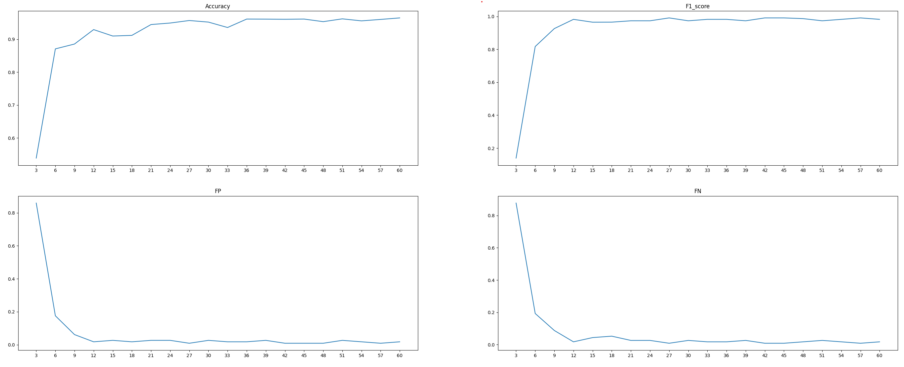
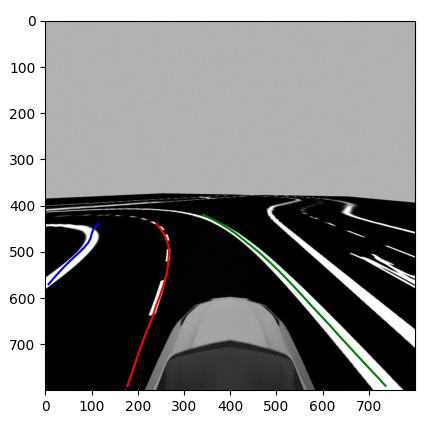
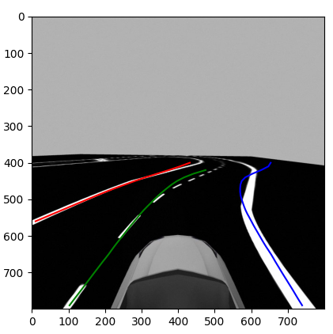
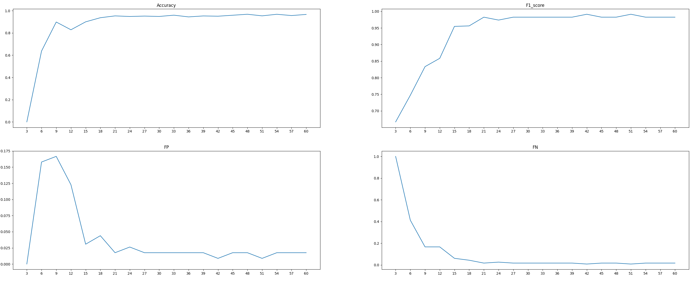
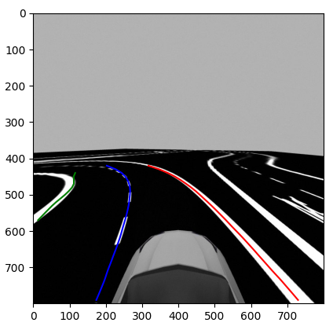

# Study Project: Lane Detection

Author: Joey van der Weijden

## Contents

1. [Introduction](#introduction)
2. [Data](#data)
    1. [Automatic approach](#automatic-approach)
    2. [Manual approach](#manual-approach)
3. [Model](#model)
4. [Training](#training)
5. [Results](#results)

## Introduction

Lane detection is a critical component in the development of Advanced Driver Assistance Systems (ADAS). Accurate identification of lane markings allows for lane keeping and safe navigation. The goal of this project was to take an existing neural network structure and train it specifically for a HSE simulation.

In this project, a deep learning approach was used to automatically learn lane features from a dataset of labelled images. Compared to more traditional computer vision techniques, which often rely on edge detection and hand-crafted filters, neural networks should be able to offer a more robust and adaptable system. However, as will be discussed during the result section, does the chosen network struggle with a highly varied environment.

During this report the words "the simulation" will occur multiple times. This refers to a Gazebo simulation environment in which a virtual car can drive around a circuit. This simulation is part of the Autonomous Systems Design course. Below is an example taken from the input images, which will are used to create the annotated dataset.

  
*Example image taken from the simulation*

## Data

### Automatic approach

The first step of the entire process was to create a dataset. To accomplish this the existing [TuSimple benchmark](https://paperswithcode.com/sota/lane-detection-on-tusimple) was used as a guideline. The goal of the data preparation step of this project was to create an annotated dataset, in the format of TuSimple, using images taken from the simulation.

The first approach was to apply traditional computer vision techniques to automatically label the images. This step has taken a large portion of the time invested into the project. It involved a lot of trial and error, but ultimately resulted in nothing but error.

One of the main challenges encountered during the development of the automatic labelling system was the need for a clean and reliable dataset. While the simulation environment provided a clear distinction in colour between the road and the lane markings, which allowed edge detection algorithms to successfully identify lane lines in many cases, translating this information into a structured and coherent output proved more difficult. Specifically, edge detection worked well for areas close to the vehicle, where lane boundaries were sharp and well-defined. However, as the lanes extended toward the horizon, the markings became increasingly blurred due to perspective and resolution limitations. This made it extremely difficult to consistently and accurately determine which edges corresponded to which lanes, leading to unreliable or ambiguous labels in those distant regions.

### Manual approach

After many attempts to get the automatic labeller to work reliably, the choice was made that the time already spent on automating the process, could also have been used to manually label the dataset and therefore the decision was made to change the approach.

#### Labeller

The dataset contained around 400 images and to label these as efficiently as possible the first step was to create a tool which allowed for easy labelling. To create this tool, the python package [TKinter](https://docs.python.org/3/library/tkinter.html) was used, which is the standard Python interface to the Tcl/Tk GUI toolkit.

The tool displays the image to be labeled, along with horizontal reference lines (known as hsamples) that represent the specific y-coordinates used in the TuSimple annotation format. These hsamples are plotted on the image to help the user determine where to place lane points. Unlike the actual TuSimple dataset, the simulated environment includes sharp turns, which can lead to situations where a single lane intersects the same hsample line more than once. This poses a problem for labeling quality, as the TuSimple format allows only one x-coordinate per hsample. If the incorrect intersection point is selected, it can cause significant errors in the shape of the detected lane, potentially distorting the entire trajectory.

This tool can be started with `labelling_tool/manual_labeller`.

  
*Image taken from the labeller, where the two out of three lanes have been labelled*

#### Quality checker

The previously mentioned issue with hsample intersections was only discovered after more than 100 images had already been labeled. This presented a dilemma: either discard all *potentially* faulty labels, or manually review each image to verify their accuracy.

The latter option was chosen to preserve as much usable data as possible. To support this process, a simple quality-checking tool was created. This tool loads each labeled image along with its corresponding labels. The user then has two options: either confirm and keep the label if the hsample intersection issue does not apply, or delete the label so that the image can be re-labeled correctly.

The quality checker tool can be started with `labelling_tool/quality_checker.py`.

#### restructure dataset

The final step in the dataset creation process was to convert the labeled images into the format required by the model. This involved splitting the data into training, validation, and test sets, using a standard 80/10/10 ratio.

To ensure a balanced distribution, all labeled images were first shuffled randomly, preventing any one subset from being biased toward a particular road section. After shuffling, a new directory was created to store all the images, while a separate annotation file was generated. This file included the lane coordinates, the corresponding hsamples, and the file path to each image—structured in accordance with the TuSimple format.

## Model

For this project CLRNet (Cross Layer Refinement Network) was selected as the neural network.

The primary motivation for choosing CLRNet was its high performance on the [TuSimple benchmark](https://paperswithcode.com/sota/lane-detection-on-tusimple). The model's accuracy scores in the top 10 twice (once with a resnet-18 backbone and once with a resnet-34 backbone). If the updated version, CLRNetV2, is also included in counting, the models have 4 out of the top 10 spots.

Another significant advantage of CLRNet was the availability of well-documented and reproducible code via its official [GitHub repository](https://github.com/Turoad/CLRNet?tab=readme-ov-file). This offered a smooth setup, training, and evaluation process without requiring extensive model engineering from scratch. The repository includes training scripts and configuration files, which streamlined the use of the model.

CLRNet (Cross Layer Refinement Network) is specifically designed to enhance lane detection by leveraging both high-level semantic features and low-level spatial details. The model first performs an initial lane prediction using high-level contextual information, and then refines the detection using low-level features to improve localization accuracy.

A key component of the architecture is the ROIGather module, which further enhances the lane feature representation. Additionally, CLRNet introduces a Line IoU loss function, which treats the entire lane as a continuous line rather than a series of points or segments, further improving detection precision.

This combination of architectural innovations enables CLRNet to  outperform previous state-of-the-art models on benchmarks like TuSimple, making it a strong candidate for real-world lane detection tasks as well as for the simulation.

*Model description taken from the [CLRNet paper](https://arxiv.org/abs/2203.10350)*

## Training

Before the training could start a new config file had to be created for the simulation dataset. The main reason for this is the different image sizes, which also resulted in a different amount of hsamples from the original TuSimple dataset.

Luckily, since the goal of the simulation dataset was to mimic the original TuSimple dataset as accurately as possible, only a few minor changes had to be made to the TuSimple config to convert is to a simulation (simsimple) config.

Besides the config there were a few other places where the TuSimple image sizes or hsamples were hardcoded, which simply had to be changed. The most challenging of these changes was within the nms_kernel which had to be rebuilt afterwards.

After these changes training was started. In total three models were trained, one for each of the resnet backbones for which the model offered a Tusimple config (resnet-18, resnet-34 and resnet-101).

For each of the trainings the same parameters have been used, which are a batch-size of 16. The datasplit is 80/10/10, as mentioned in the data section. As optimiser AdamW was used.

Training for the model with the resnet-18 backbone took roughly 18 minutes (for 70 epochs)  
Training for the model with the resnet-34 backbone took roughly 20 minutes (for 60 epochs)  
Training for the model with the resnet-101 backbone took roughly 1 hour 54 minutes (for 60 epochs)

*All models have been locally trained on a RTX-3080 with an intel i5-12600KF.*

## Results

In the final stage of the project, the performance of CLRNet was evaluated using the custom SimSimple dataset. At first glance, the model's performance appeared strong—achieving an accuracy of 96.64%, which is consistent with its reported performance on the TuSimple benchmark. However, closer inspection of individual predictions revealed certain limitations.

For example, in one case using the ResNet-18 backbone, the model failed to detect the right lane entirely, and the center lane prediction was significantly skewed. In contrast, the ResNet-34 and ResNet-101 versions of CLRNet performed better, successfully detecting all lanes with improved consistency. Nevertheless, even these deeper models struggled with lane detection as the road extended toward the horizon, resulting in distorted or inaccurate lane predictions in the distance.

This performance drop at longer ranges highlights a key trade-off in lane detection: reducing the prediction range could improve accuracy in the visible area but would limit the situational awareness necessary for real-time autonomous driving decisions.

Another challenge uncovered during testing was the model's apparent bias toward straight roads. The SimSimple dataset, which includes more complex and curved lanes compared to TuSimple, exposed CLRNet’s weakness in handling curvature. This suggests that the model may have overfit to the characteristics of the TuSimple dataset, which contains relatively few curved lane examples.

To address these limitations, future work could focus on two key areas: expanding and diversifying the training dataset—particularly by including more curved and complex lane scenarios and experimenting with different models.

Despite its challenges, CLRNet remains a strong foundation for lane detection, and this project has demonstrated both its potential and its boundaries in practical applications.

|   Backbone   |      F1   | Acc |      FDR     |      FNR   |
|    :---       |          ---:          |       ---:       |       ---:       |      ---:       |
| [ResNet-18][18]     |    97.37    |   94.50  |    2.63  |  2.63      |
| [ResNet-34][34]       |   98.25              |    96.47          |   1.75          |    1.75      |
| [ResNet-101][101]      |   98.25|   96.64  |   1.75   |  1.75  |

[18]: #resnet-18
[34]: #resnet-34
[101]: #resnet-101

### resnet-18

**Training**  

**Example prediction**  

### resnet-34

**Training**  

**Example predictions**  

### resnet-101

**Training**  

**Example predictions**  

